# Who's that Pokemon


En este repositorio iremos realizando una aplicación de adivinar el pokemon, siguiendo una serie de pasos tutorizados por la profesora. El proceso de realización será documentado en este README.md y con capturas

La aplicación la realizaremos en Vue, con el template de TypeScript. Usaremos Composition API y nuestra estructura de archivos va a estar basada en _screaming architecture_

### Índice

- [Reto 1 - Iniciando Proyecto 'Pokemon Game'](#r1)

- [Reto 2 - Estructura de la Aplicación](#r2)

    - [Editando el Codigo](#r2-editando)

- [Reto 3 - Creando el esqueleto de Pokemon Game](#r3)

    - [PokemonPickture.vue](#popi)

    - [PokemonOptions.vue](#po)


### Reto 1 - Iniciando Proyecto Pokemon Game <a name="r1"></a>

<div align=center>
    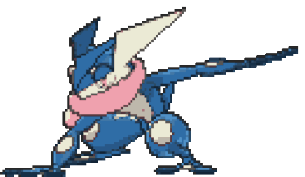
    
    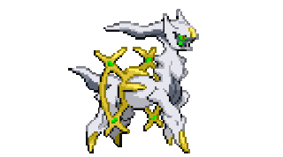
</div>

<br>

Empezaremos creando el proyecto con:

```bash
    npm create vue@latest 
```

Y configuramos el proyecto como queremos:

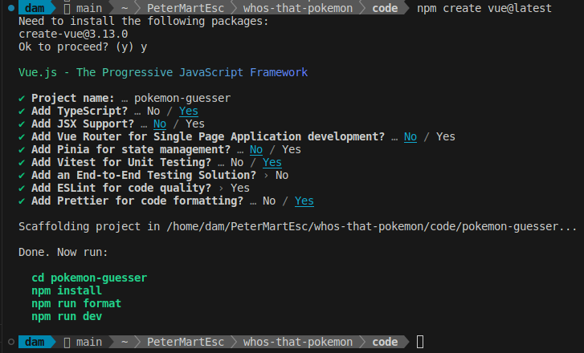

> __Pregunta 1__: ¿Para qué sirve Vue Router, Pinia, Vitest, ESLint y Prettier? Responde a esta pregunta en el README del repositorio del proyecto.

> __Vue Router__: utilidad para crear `rutas` en __Vue__. Configuramos en un fichero las rutas deseadas y los componentes a los que están asociados.

> __Pinia__: reduce la complejidad al trabajar con __Vue__ y el `Composition API` en aplicaciones ligeras. Entre otras cosas, trabaja con `stores` en vez de `modulos` y tiene mejor soporte para __TypeScript__.

> __Vitest__: biblioteca para la realización de `test unitarios` de aplicaciones de __Vue__.

> __ESLint__: plugin que nos permite verificar los `<template>`, `<script>` y el codigo de los `.js` de __Vue__. Este encuentra errores en la sintaxis, usos incorrectos de directivas y violaciones en la Guía de estilos  de __Vue__.

> __Prettier__: ayuda a darle un formato uniforme al codigo. Lo hace mucho más legible bajo una serie de configuraciones definidas.


Continuando con el codigo, procedemos a iniciar el proyecto para comprobar que funciona correctamente:

```bash
    npm install
    npm run dev
```

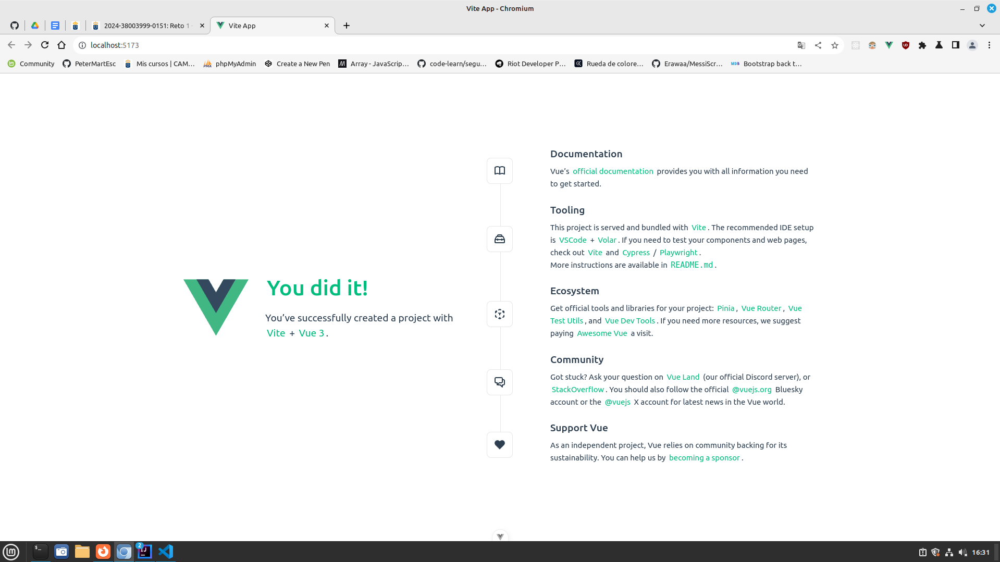

Como hemos dicho nuestro Pokemon Game lo vamos a realizar siguiendo `Composition API` y además, nuestra estructura de archivos va a estar basada en `screaming architecture`.

> __Pregunta 2.1__: ¿Qué es Composition API y en qué se diferencia de Option API en VueJS?

> __Composition API__:  es una forma mejorada para realizar las aplicaciones a partir de Vue 3. Está diseñado de forma que el proyecto tenga una alta escalabilidad, es decir, que se pueda mejorar y que sus componentes sean reutilizables.


Imagen obtenida de la web de [Manz.Dev](https://lenguajejs.com/vuejs/componentes/composition-api/)

> __Pregunta 2.2__: ¿Qué es screaming architecture y qué ventajas tiene?

> __Screaming architecture__: es un tipo de arquitectura cuyo objetivo es que la estructura principal del código base transmita de inmediato el propósito de la aplicación.

Por ejemplo:

```bash
/src
    /orders
        Order.cs
        OrderService.cs
        OrderRepository.cs
    /inventory
        InventoryItem.cs
        InventoryService.cs
        InventoryRepository.cs
```

A continuación borraremos y modificaremos todo lo que no necesitamos que nos ha creadfo de forma automática Vue:

- El contenido de App.vue. Deja la estructura básica de VueJS teniendo en cuenta que usaremos Composition API. Recuerda que vamos a utilizar TS en lugar de JS, ¿cómo se lo indicamos a Vue?

    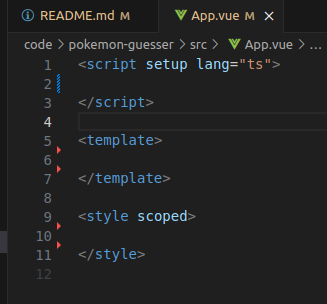

    Se lo indicamos cambiando el contenido de `lang` de __js__ a __ts__.

- Añade un mensaje de Hola mundo en App.vue

    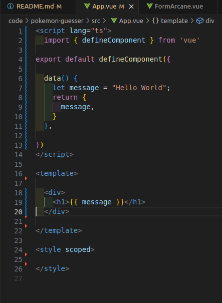

- En la carpeta de `assets`, borra los archivos `base.css` y `logo.svg`

- Cambia el nombre de `main.css` de la carpeta assets a `styles.css` y modifica la ruta en el archivo `main.ts` para que funcione correctamente nuestra hoja de estilo.

- Ejecuta el comando npm run dev y muestra el resultado.

    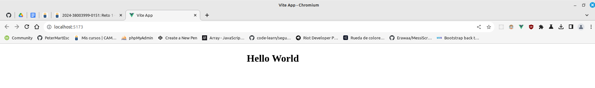

Finalmente, configuraremos el proyecto para usar el framework de CSS __TailwindCSS__:

```bash
    npm install -D tailwindcss postcss autoprefixer
    npx tailwindcss init -p
```

Editamos el `tailwind.config.js` para que se vea de la siguiente forma:

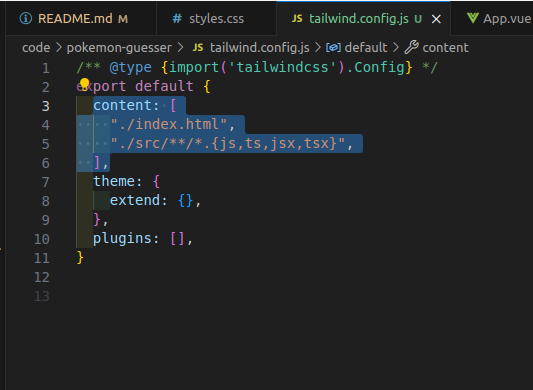

Añadimos un archivo `index.css` en la ruta `pokemon-gesser/src/assets` con el siguiente contenido:

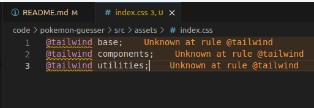

Añadimos un classname al componente de `hello world` de la siguiente forma: 

Y ejecutamos el proyecto de nuevo con `npm run dev`

Finalmente comprobamos el mensaje de __Hello World__ para ver si ha cambiado:

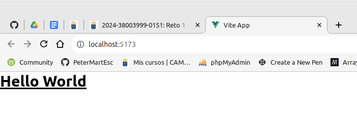

Si se ve así, hemos realizado el reto 1 correctamente.

<div align=center>
    
</div>

### Reto 2 - Estructura de la aplicación <a name="r2"></a>

<div align=center>
    
    
    
</div>

<br>

Continuamos por donde lo dejamos en la práctica anterior. En el reto anterior vimos el concepto de `screaming architecture` y hoy vamos a darle esa estructura a nuestro proyecto.

La idea es que, al observar la __estructura del código__, los nombres de las __carpetas__, los __módulos__ o las __clases__, sea evidente qué hace el sistema o cuál es su propósito principal.

Lo primero, será borrar la carpeta de de `components`. Crearemos en su lugar una nueva carpeta en `src/` llamada `modules`, y dentro de ella una de `pokemon`. 

<div align=center>
    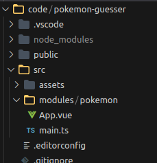
</div>

Dentro de la carpeta de `pokemon` vamos a tener todos los __archivos__ que estén __relacionados con nuestro juego__ de `pokemon`. La mayor parte de nuestro código irá dentro de esta carpeta.

Creamos una nueva carpeta llamada `composables`, 

> __Pregunta 1__: ¿qué es un `composable` en __VueJS__ y cual es la nomenclatura común que se utiliza en los ficheros que contiene?

> Es un patrón con una de las novedades más interesantes que nos trae la API de Composición de Vue 3. Nos permite usar la reactividad fuera de componentes, de forma sencilla. 

También creamos una nueva carpeta llamada `components` y otra llamada `views`

<div align=center>
    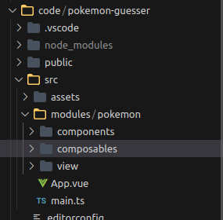
</div>

Dentro de la carpeta de `views`, vamos a crear el archivo __PokemonGame.vue__

> __Pregunta 2__: ¿cuál crees que será la lógica que irá dentro de este archivo?

> La parte visual de la aplicación, toda la logica de lo que se muestra. En el resto de carpetas irá el resto de la lógica. Elección, pokemon random, etc

Generamos toda la estructura base de vue dentro

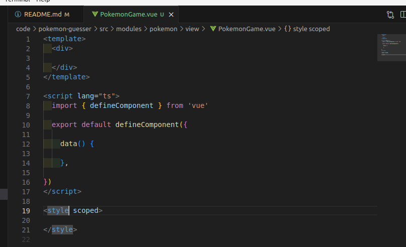

> __Pregunta 3__: ¿Conoces algún atajo para generar esta estructura de forma automática? ¿Con qué extensión y cuál?

> Si, la extensión [Vue VSCode Snippets](https://marketplace.visualstudio.com/items?itemName=sdras.vue-vscode-snippets)

#### Editando PokemonGame <a name="r2-editando"></a>

Usando la etiqueta `<section>` de HTML, vamos a dividir nuestro template. En la primera sección tendremos dos mensajes que indica al usuario _Espere por favor_ y _Cargando Pokémons_

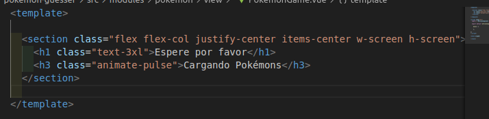

> __Pregunta 4.1__: ¿Para que sirven las clases añadidas?

> La etiqueta `<section>` tiene un __flex__ y __flex-col__ que le dan el display de flex y la disposición de columna. El __justify-center__ se alinea en el centro del eje principal (en este caso __en columna__) __items-center__ alinea lo que contiene en centro del espacio que contiene. Finalmente __w-screen__ y __h-screen__ establecen el ancho y alto del elemento al maximo de la ventana gráfica.

> La etiqueta `<h1>` tiene un __text-3xl__, que establece el texto al tamaño 3xl (que será como el xl 3 veces), y la `<h3>` un __animate-pulse__, lo que le da un efecto de "pulse" pre establecido por __TailWind__


Luego de crear, lo importamos en `App.tsx`, y debería verse así:

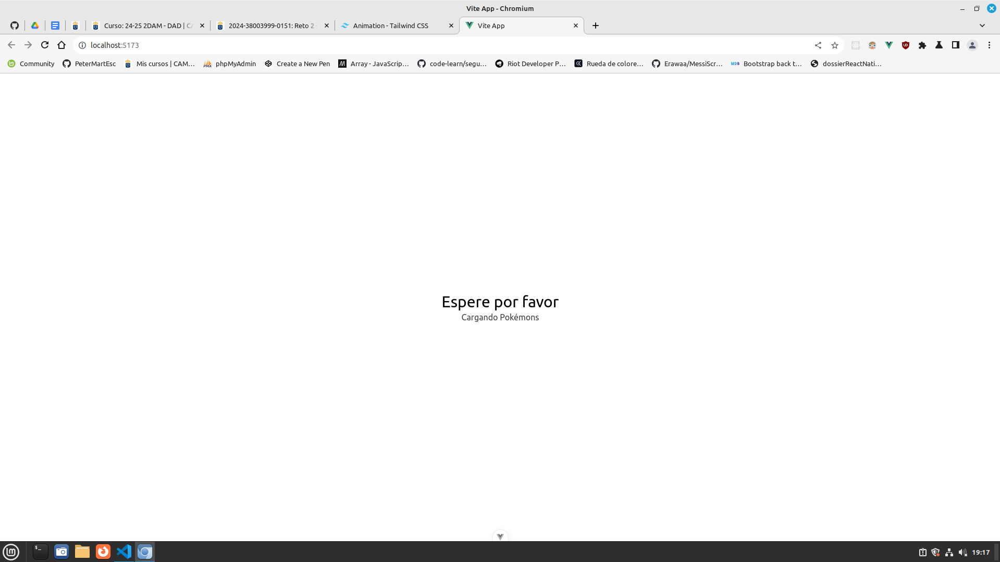

> __Pregunta 4.2__: ¿Como ocultaríamos esta sección por completo usando una directiva de __VueJS__?

> Con __v-show=false__ ocultaríamos el elemento deseado.

Ahora crearemos otra sección que diga el mensaje de _¿Cuál es este Pokémon?_

En esta sección añadiremos dos componentes: Pokemon Picture y Pokemon Options 

> __Pregunta 4.3__: ¿para qué crees que sirven?

> Sirven para la lógica de la imagen del pokemon aleatorio y las opciones de elección de pokemon.

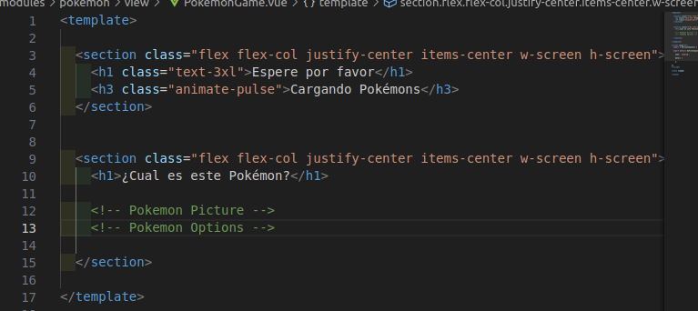

Y con esto, terminamos el reto 2 correctamente.

<div align=center>
    
</div>

### Reto 3 - Creando el esqueleto de Pokemon Game <a name="r3"></a>

<div align=center>
    
    
    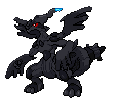
</div>

El objetivo de este reto es generar un "esqueleto" de cómo queremos que se visualicen los elementos en nuestro juego. Es decir, lo que conocemos como un mockup, pero esta vez programando.

Al acabar el reto, querremos tener algo parecido a esto:

<div align=center>
    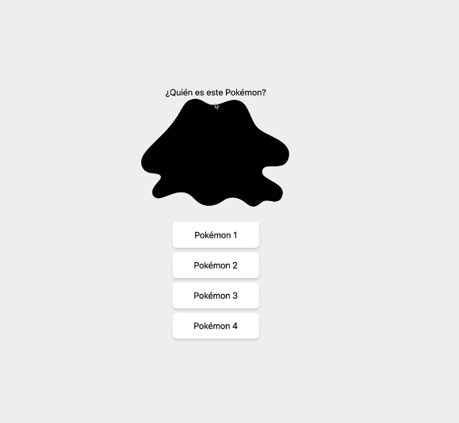
</div>

#### PokemonPicture.vue <a name="popi"></a>

En este componente vamos a importar directamente, desde PokeApi, una imagen de un pokemon (Ditto para ser más exactos).

Siguiendo la misma forma que en PokemonGame.vue de las secciones, en este componente nos crearemos una sección que contendrá una imagen del pokemon Ditto. (No es necesario realizar la conexión directamente a la API, copia y pega la url de la imagen y muéstrala).

<div align=center>
    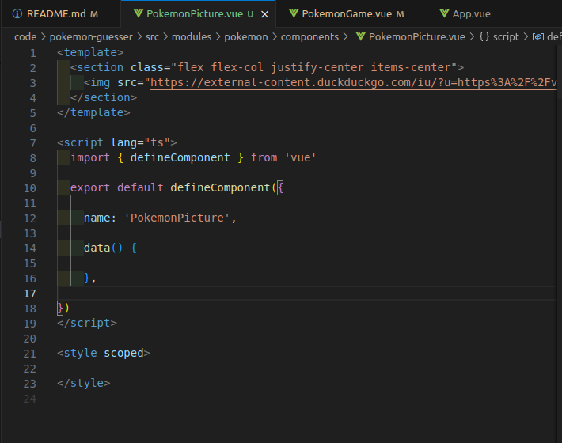
</div>

<div align=center>
    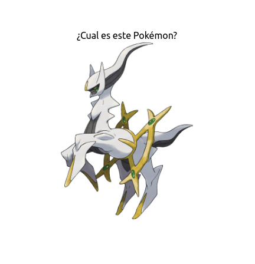
</div>

Ahora añadimos la clase de Tailwind CSS llamada `brightness-0` y la clase h-[200px]

> __Pregtunta 1__: ¿para qué sirve la clase __h-[200px]__?

Establece la altura a 200px

<div align=center>
    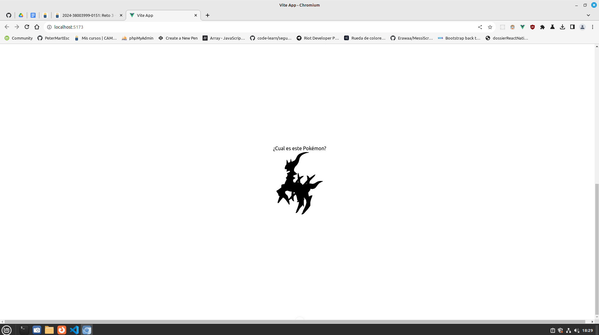
</div>

#### PokemonOptions.vue <a name="po"></a>

A continuación simularemos las opciones de los Pokemon. Esto lo haremos con una lista de HTML, y nos quedará de la siguiente forma:

<div align=center>
    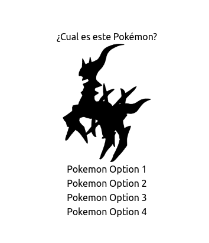
</div>

Finalmente, le daremos estilo a los elementos de la lista, para que se vea como un botón. Luego de darle `#f1f1f1` de color de fondo, se debería ver así:

<div align=center>
    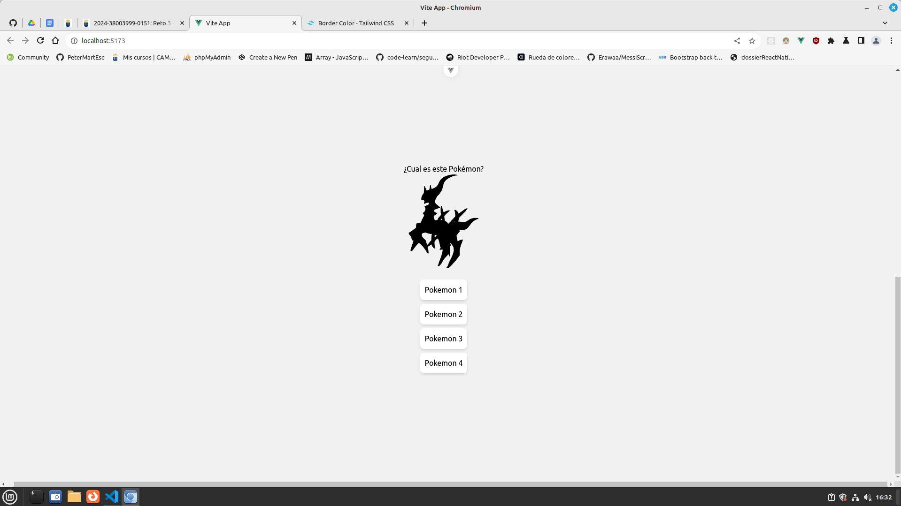
</div>

Y con esto, terminamos la práctica 3

<div align=center>
    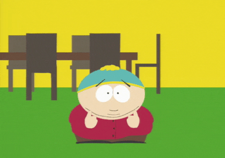
</div>

_(Cartman despide la pratica hoy, Kenny sufrió un accidente)_

### Reto 4 - Conectando la API usando Axios <a name="r4"></a>

<div align=center>
    
    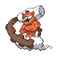
    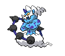
</div>

Para realizar el __Reto 4__, tenemos que tener el codigo base medianamente parecido al de la profesora. Luego de comparar y arreglar algún detalle, continuamos de la siguiente forma

