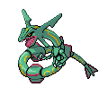
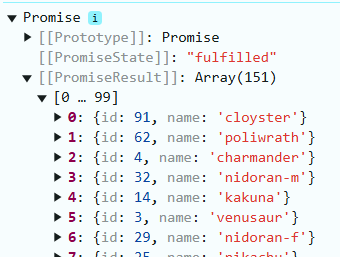

# Who's that Pokemon


En este repositorio iremos realizando una aplicación de adivinar el pokemon, siguiendo una serie de pasos tutorizados por la profesora. El proceso de realización será documentado en este README.md y con resources

La aplicación la realizaremos en Vue, con el template de TypeScript. Usaremos Composition API y nuestra estructura de archivos va a estar basada en _screaming architecture_

### Índice

- [Reto 1 - Iniciando Proyecto 'Pokemon Game'](#r1)

- [Reto 2 - Estructura de la Aplicación](#r2)

    - [Editando el Codigo](#r2-editando)

- [Reto 3 - Creando el esqueleto de Pokemon Game](#r3)

    - [PokemonPickture.vue](#popi)

    - [PokemonOptions.vue](#po)

- [Reto 4 - Conectando la API usando Axios](#r4)

- [Reto 5 - Modificando método getPokemons()](#r5)

    - [Modificando getPokemons()](#r5-modf-getPokemon)

    - [Modificando el orden de los Pokemons](#r5-modf-ord)


### Reto 1 - Iniciando Proyecto Pokemon Game <a name="r1"></a>

<div align=center>
    
    
    
</div>

<br>

Empezaremos creando el proyecto con:

```bash
    npm create vue@latest 
```

Y configuramos el proyecto como queremos:

<div align=center>
    
</div>

> __Pregunta 1__: ¿Para qué sirve Vue Router, Pinia, Vitest, ESLint y Prettier? Responde a esta pregunta en el README del repositorio del proyecto.

> __Vue Router__: utilidad para crear `rutas` en __Vue__. Configuramos en un fichero las rutas deseadas y los componentes a los que están asociados.

> __Pinia__: reduce la complejidad al trabajar con __Vue__ y el `Composition API` en aplicaciones ligeras. Entre otras cosas, trabaja con `stores` en vez de `modulos` y tiene mejor soporte para __TypeScript__.

> __Vitest__: biblioteca para la realización de `test unitarios` de aplicaciones de __Vue__.

> __ESLint__: plugin que nos permite verificar los `<template>`, `<script>` y el codigo de los `.js` de __Vue__. Este encuentra errores en la sintaxis, usos incorrectos de directivas y violaciones en la Guía de estilos  de __Vue__.

> __Prettier__: ayuda a darle un formato uniforme al codigo. Lo hace mucho más legible bajo una serie de configuraciones definidas.


Continuando con el codigo, procedemos a iniciar el proyecto para comprobar que funciona correctamente:

```bash
    npm install
    npm run dev
```
<div align=center>
    
</div>


Como hemos dicho nuestro Pokemon Game lo vamos a realizar siguiendo `Composition API` y además, nuestra estructura de archivos va a estar basada en `screaming architecture`.

> __Pregunta 2.1__: ¿Qué es Composition API y en qué se diferencia de Option API en VueJS?

> __Composition API__:  es una forma mejorada para realizar las aplicaciones a partir de Vue 3. Está diseñado de forma que el proyecto tenga una alta escalabilidad, es decir, que se pueda mejorar y que sus componentes sean reutilizables.

<div align=center>
    
</div>

Imagen obtenida de la web de [Manz.Dev](https://lenguajejs.com/vuejs/componentes/composition-api/)

> __Pregunta 2.2__: ¿Qué es screaming architecture y qué ventajas tiene?

> __Screaming architecture__: es un tipo de arquitectura cuyo objetivo es que la estructura principal del código base transmita de inmediato el propósito de la aplicación.

Por ejemplo:

```bash
/src
    /orders
        Order.cs
        OrderService.cs
        OrderRepository.cs
    /inventory
        InventoryItem.cs
        InventoryService.cs
        InventoryRepository.cs
```

A continuación borraremos y modificaremos todo lo que no necesitamos que nos ha creadfo de forma automática Vue:

- El contenido de App.vue. Deja la estructura básica de VueJS teniendo en cuenta que usaremos Composition API. Recuerda que vamos a utilizar TS en lugar de JS, ¿cómo se lo indicamos a Vue?

<div align=center>
    
</div>

Se lo indicamos cambiando el contenido de `lang` de __js__ a __ts__.

- Añade un mensaje de Hola mundo en App.vue

<div align=center>
    
</div>

- En la carpeta de `assets`, borra los archivos `base.css` y `logo.svg`

- Cambia el nombre de `main.css` de la carpeta assets a `styles.css` y modifica la ruta en el archivo `main.ts` para que funcione correctamente nuestra hoja de estilo.

- Ejecuta el comando npm run dev y muestra el resultado.

<div align=center>
    
</div>

Finalmente, configuraremos el proyecto para usar el framework de CSS __TailwindCSS__:

```bash
    npm install -D tailwindcss postcss autoprefixer
    npx tailwindcss init -p
```

Editamos el `tailwind.config.js` para que se vea de la siguiente forma:

<div align=center>
    
</div>

Añadimos un archivo `index.css` en la ruta `pokemon-gesser/src/assets` con el siguiente contenido:

<div align=center>
    
</div>

Añadimos un classname al componente de `hello world` de la siguiente forma: 

Y ejecutamos el proyecto de nuevo con `npm run dev`

Finalmente comprobamos el mensaje de __Hello World__ para ver si ha cambiado:


Si se ve así, hemos realizado el reto 1 correctamente.

<div align=center>
    
</div>

### Reto 2 - Estructura de la aplicación <a name="r2"></a>

<div align=center>
    
    
    
</div>

<br>

Continuamos por donde lo dejamos en la práctica anterior. En el reto anterior vimos el concepto de `screaming architecture` y hoy vamos a darle esa estructura a nuestro proyecto.

La idea es que, al observar la __estructura del código__, los nombres de las __carpetas__, los __módulos__ o las __clases__, sea evidente qué hace el sistema o cuál es su propósito principal.

Lo primero, será borrar la carpeta de de `components`. Crearemos en su lugar una nueva carpeta en `src/` llamada `modules`, y dentro de ella una de `pokemon`. 

<div align=center>
    
</div>

Dentro de la carpeta de `pokemon` vamos a tener todos los __archivos__ que estén __relacionados con nuestro juego__ de `pokemon`. La mayor parte de nuestro código irá dentro de esta carpeta.

Creamos una nueva carpeta llamada `composables`, 

> __Pregunta 1__: ¿qué es un `composable` en __VueJS__ y cual es la nomenclatura común que se utiliza en los ficheros que contiene?

> Es un patrón con una de las novedades más interesantes que nos trae la API de Composición de Vue 3. Nos permite usar la reactividad fuera de componentes, de forma sencilla. 

También creamos una nueva carpeta llamada `components` y otra llamada `views`

<div align=center>
    
</div>

Dentro de la carpeta de `views`, vamos a crear el archivo __PokemonGame.vue__

> __Pregunta 2__: ¿cuál crees que será la lógica que irá dentro de este archivo?

> La parte visual de la aplicación, toda la logica de lo que se muestra. En el resto de carpetas irá el resto de la lógica. Elección, pokemon random, etc

Generamos toda la estructura base de vue dentro

<div align=center>
    
</div>

> __Pregunta 3__: ¿Conoces algún atajo para generar esta estructura de forma automática? ¿Con qué extensión y cuál?

> Si, la extensión [Vue VSCode Snippets](https://marketplace.visualstudio.com/items?itemName=sdras.vue-vscode-snippets)

#### Editando PokemonGame <a name="r2-editando"></a>

Usando la etiqueta `<section>` de HTML, vamos a dividir nuestro template. En la primera sección tendremos dos mensajes que indica al usuario _Espere por favor_ y _Cargando Pokémons_

<div align=center>
    
</div>

> __Pregunta 4.1__: ¿Para que sirven las clases añadidas?

> La etiqueta `<section>` tiene un __flex__ y __flex-col__ que le dan el display de flex y la disposición de columna. El __justify-center__ se alinea en el centro del eje principal (en este caso __en columna__) __items-center__ alinea lo que contiene en centro del espacio que contiene. Finalmente __w-screen__ y __h-screen__ establecen el ancho y alto del elemento al maximo de la ventana gráfica.

> La etiqueta `<h1>` tiene un __text-3xl__, que establece el texto al tamaño 3xl (que será como el xl 3 veces), y la `<h3>` un __animate-pulse__, lo que le da un efecto de "pulse" pre establecido por __TailWind__


Luego de crear, lo importamos en `App.tsx`, y debería verse así:

<div align=center>
    
</div>

> __Pregunta 4.2__: ¿Como ocultaríamos esta sección por completo usando una directiva de __VueJS__?

> Con __v-show=false__ ocultaríamos el elemento deseado.

Ahora crearemos otra sección que diga el mensaje de _¿Cuál es este Pokémon?_

En esta sección añadiremos dos componentes: Pokemon Picture y Pokemon Options 

> __Pregunta 4.3__: ¿para qué crees que sirven?

> Sirven para la lógica de la imagen del pokemon aleatorio y las opciones de elección de pokemon.

<div align=center>
    
</div>

Y con esto, terminamos el reto 2 correctamente.

<div align=center>
    
</div>

### Reto 3 - Creando el esqueleto de Pokemon Game <a name="r3"></a>

<div align=center>
    
    
    
</div>

El objetivo de este reto es generar un "esqueleto" de cómo queremos que se visualicen los elementos en nuestro juego. Es decir, lo que conocemos como un mockup, pero esta vez programando.

Al acabar el reto, querremos tener algo parecido a esto:

<div align=center>
    
</div>

#### PokemonPicture.vue <a name="popi"></a>

En este componente vamos a importar directamente, desde PokeApi, una imagen de un pokemon (Ditto para ser más exactos).

Siguiendo la misma forma que en PokemonGame.vue de las secciones, en este componente nos crearemos una sección que contendrá una imagen del pokemon Ditto. (No es necesario realizar la conexión directamente a la API, copia y pega la url de la imagen y muéstrala).

<div align=center>
    
</div>

<div align=center>
    
</div>

Ahora añadimos la clase de Tailwind CSS llamada `brightness-0` y la clase h-[200px]

> __Pregtunta 1__: ¿para qué sirve la clase __h-[200px]__?

Establece la altura a 200px

<div align=center>
    
</div>

#### PokemonOptions.vue <a name="po"></a>

A continuación simularemos las opciones de los Pokemon. Esto lo haremos con una lista de HTML, y nos quedará de la siguiente forma:

<div align=center>
    
</div>

Finalmente, le daremos estilo a los elementos de la lista, para que se vea como un botón. Luego de darle `#f1f1f1` de color de fondo, se debería ver así:

<div align=center>
    
</div>

Y con esto, terminamos la práctica 3

<div align=center>
    
</div>

_(Cartman despide la prática hoy, Kenny sufrió un accidente)_

### Reto 4 - Conectando la API usando Axios <a name="r4"></a>

<div align=center>
    
    
    
</div>

Para realizar el __Reto 4__, tenemos que tener el codigo base medianamente parecido al de la profesora. Luego de comparar y arreglar algún detalle, continuamos de la siguiente forma

<div align=center>
    
</div>

Antes que nada, vamos a colocar el archivo [animations.css](/resources/files/animations.css) en `src/assets/`. Este archivo contiene una clase CSS llamada fade-in, que es un animación que usaremos cuando desvelemos el Pokémon. 

El juego va a tener 3 estados: __gana, pierde y jugando__. Estos estados los vamos a almacenar en una propiedad reactiva. 

Como vamos a tener que usar estos estados, lo mejor va a ser que nos creemos una __interfaz__. Para ello, dentro de la carpeta pokemon vamos a crear una nueva llamada `interfaces`, y en él crearemos un archivo llamado `game-status.enum.ts`. 

Aunque técnicamente la enumeración no cuenta como una interfaz en sí, vamos a crearlo de esta manera. El contenido de este archivo es el siguiente:

<div align=center>
    
</div>

Ahora, crearemos un nuevo archivo llamado `index.ts` que será nuestro archivo de __barril__. 

> __Pregunta 1:__¿A qué nos referimos con este término en programación y cuáles son sus ventajas? 

> La finalidad de este __archivo barril__ es que todos los componentes estén centralizados. Esto lo hacemos importando multiples componentes en un mismo archivo. 

> El beneficio de usar este archivo barril, es que podemos importar todos nuestros componentes en una misma linea.

<div align=center>
    
</div>

Volvemos a nuestro archivo `usePokemonGame.ts` y lo completamos con lo siguiente:

<div align=center>
    
</div>

Ahora, vamos a conectarnos con nuestra __PokeApi__ para poder recuperar una lista con los pokemons que vamos a usar en nuestro juego. Para ello, vamos a utilizar __Axios__. 

> __Pregunta 2__: ¿Qué es Axios? ¿Lo has usado antes?

> Es una librería para hacer peticiones __HTTP__. Las hemos usado anteriormente para trabajar con __React__ y __React-Native__.

Dentro de la carpeta de pokemon creamos una nueva llamada __api__ y crea un archivo `pokemonApi.ts.` 

Instalamos __axios__ en el proyecto y dentro del archivo que acabamos de crear, usa __axios__ para realizar la conexión con [Pokemon Api]().

<div align=center>
    
</div>

Lo exportamos y guardamos los cambios.

En `usePokemonGame.ts` lo que tenemos que hacer ahora es obtener esa información sobre los 151 pokemon. Para ello:

<div align=center>
    
</div>

Comprobamos que funciona y mostramos el resultado de la consola de la aplicación importando nuestro __composable__ en el componente de `PokemonGame.vue` de la siguiente forma: 

<div align=center>
    
</div>

Los datos que hemos obtenido no son técnicamente los que nos interesan, ya que solo necesitamos el __id__ y el __nombre__ de los __Pokemon__. Por tanto, lo que vamos a hacer es crear un __tipado estricto__ para que podamos tipar los resultados de las peticiones __HTTP__ que hagamos a la _API_ de __Pokemon__. 

Para ello:

- Abre Postman.

- Realiza una petición a PokeApi (no importa cuantos pokemon recuperes, puedes poner por ejemplo 1000). 

- Copia el código de la respuesta.

- Vuelve a Visual Studio y dentro de la carpeta de interfaces crea un archivo llamado pokemon-list.response.ts.

- Usa la extensión de Paste JSON as Code y ponle a nivel superior (PokemonListResponse) y dale a enter. De esta manera tenemos guardados los resultados de nuestra petición.

<div align=center>
    
</div>

- Exporta este nuevo archivo en nuestro archivo de barril.

<div align=center>
    
</div>

- Modificamos el archivo `pokemonApi.ts` de la siguiente manera: 

<div align=center>
    
</div>

- Ahora en `response.data` vamos a tener toda la información de la petición:

<div align=center>
    
</div>

Y con esto ya tendríamos el __Reto 4__

<div align=center>
    
</div>

_(Ya está Kenny de vuelta )_


### Reto 5 - Modificando método getPokemons() <a name="r5"></a>

<div align=center>
    
    
    
</div>

En el reto anterior, habíamos conectado ya nuestra app de Vue con PokeApi usando Axios. Sin embargo, comentamos que de la respuesta que obteníamos  solo nos interesaba saber el `id` y el `nombre` del __pokemon__.

#### Modificando el getPokemons <a name="r5-modf-getPokemon"></a>

Vamos a modificar el método `getPokemons` que hemos creado en el archivo `usePokemonGame.ts` para quedarnos solo con el nombre y el id de la respuesta.

Vamos a crear un nuevo archivo dentro de la carpeta __interfaces__ que se va a llamar `pokemon.interface.ts` y crea una __interfaz__ para __Pokemon__ que contenga el __id__ de tipo `number` y __name__ de tipo `string`.

<div align=center>
    
</div>

Lo __exportamos__ de la misma forma que hemos hecho con los archivos hasta ahora. Luego volvemos a `usePokemonGame.ts` e __importamos__ la __interfaz__ que acabamos de crear:

<div align=center>
    
</div>

Modificamos el método getPokemons de la siguiente forma:

<div align=center>
    
</div>

> ¿Qué es lo que estamos haciendo? ¿Para qué sirve la línea de código: const id = urlParts[urlParts.length - 2] ?? 0;?

> Estamos codgiendo cada elemento pokemon que devuelve la api, tomando su campo url y dividiendola utilizando como separador el elemento _' / '_. Esto nos devuelve un array de las partes divididas, del cual cogemos la penúltima posición del array _(length -2, es decir, el id del pokemon)_ y el _' ?? 0 '_ indica que si ese elemento es _null_ o _undefined_, ponga un 0. 

> Dato: el id: +id tiene como propósito convertir el id a tipo number, es un operador unario.

Ahora llamaremos a nuestro método modificando el `onMounted()` que habíamos creado anteriormente de la siguiente manera:

<div align=center>
    
</div>

Lo que nos devuelve:

<div align=center>
    
</div>

_(Nota: en la captura solo se ven los primeros 99 elementos ya que el array está dividido en dos desplegables al mostrarlos en el console log, debido a su tamaño)_

#### Modificando el orden de los pokemon obtenidos <a name="r5-modf-ord"></a>

El __resultado__ ahora nos muestra una lista de los __151 pokemons__ ordenados según su `id`. Nosotros __NO__ queremos que estén ordenados, por tanto vamos a hacer que nuestra lista nos la devuelva de forma aleatoria.

Modificamos el __return__ del método `getPokemons` usando la función `sort` de __javascript__, junto con `Math.random()` para devolver la __lista de Pokemons__ desordenada:

<div align=center>
    
</div>

<div align=center>
    
</div>

Al hacer esto, hemos terminado con el Reto 5

<div align=center>
    
</div>

### Reto 6 - Final <a name="r6"></a>

Este será el __ultimo__ reto de la tarea. Retomamos el trabajo realizado al final del __reto anterior__, donde conseguíamos obtener una __lista de pokemons aleatorios__.

Para continuar, lo que debemos hacer es poder determinar varias __propiedades computadas__ que vamos a necesitas, por ejemplo cuándo nuestra página está cargando. 

Hay un momento en la __petición HTTP__ está trayendo la información, por tanto, podemos crear una __propiedad computada__ para que se __cambie automáticamente__. 

> ¿Qué es una propiedad computada?

> Es la posibilidad de tener propiedades cuyo valor irá variando en tiempo de ejecución.

En usePokemonGame.ts creamos una nueva __propiedad computada__ llamada `isLoading` de la siguiente forma:

<div align=center>
    
</div>

<div align=center>
    
</div>

Lo que estamos haciendo aquí es determinar si el __array de Pokemon__ está o no __vacío__, de tal forma que podamos mostrar o no cierta información en base a ello, como por ejemplo:

Mostrar en `PokemonGame.vue` el mensaje de "Espere por favor" y "Cargando Pokemons":

<div align=center>
    
</div>

Al probar lo anterior, notamos que el cambio es prácticamente imperceptible, por lo que vamos a añadir una promesa en `onMounted()` del archivo `usePokemonGame` usando la función `setTimeout` para que al cargar la respuesta, tarde __1000 milésimas__ de segundo:

<div align=center>
    
</div>

Una vez realizado esto, lo borramos, ya que no lo necesitaremos.

<div align=center>
    
</div>

Ahora vamos a crear otra propiedad reactiva a la que vamos a llamar `pokemonOptions`:

<div align=center>
    
</div>

Estos `pokemonOption` van a ser las opciones de los __Pokemons__ que vamos a mostrar, y por tanto, tenemos que crear una nueva función para manejarlas:

<div align=center>
    
</div>

> ¿Cómo funciona este fragmento de código? 

> Primero creamos un pokemonOptions de tipo lista de Pokemon. Luego, en getNextOptions, copiamos los primeros 4 elementos del array (el método slice copia parte de un array, en este caso desde la posición 0 a la 4 que es la marcada como máxima), y luego


Muestra por consola `pokemonOptions.value` para comprobar que efectivamente nos está devolviendo __4 pokemons__ como propiedades reactivas.